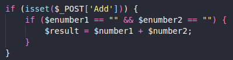
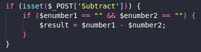
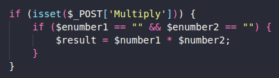
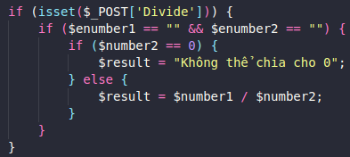

# PHP - Simple Calculator Program
Thực hiện bởi: Nguyễn Tuấn Nguyên
## Trong bài bao gồm:
1. Nhập vào 2 số
1. Kiểm tra

    - 

1. Tính tổng và in ra kết quả

    - 

1. Tính hiệu và in ra kết quả

    - 

1. Tính tích và in ra kết quả

    - 

1. Tính thương và in ra kết quả

    - 
